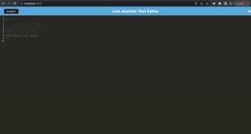
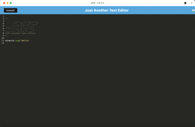

# Text-Editor
Module 19 Challenge
# Description
This application is a text editor. This application was built with an installation ability as well as local storage. This application uses technologies such as webpack, inject manifect, and service workers.
# Installation
To run this application, the user must download the source code, install node.js, run npm i, run npm run build, run npm start. 
# Screenshots of Application

# Deployed Application

# Credits
To build this application, I utilized starter code provided by the University of Utah Coding Bootcamp, ideas from activities worked on in the coding bootcamp, as well as help from TA's Brancdon Ashby and Benjamin Bushman. 